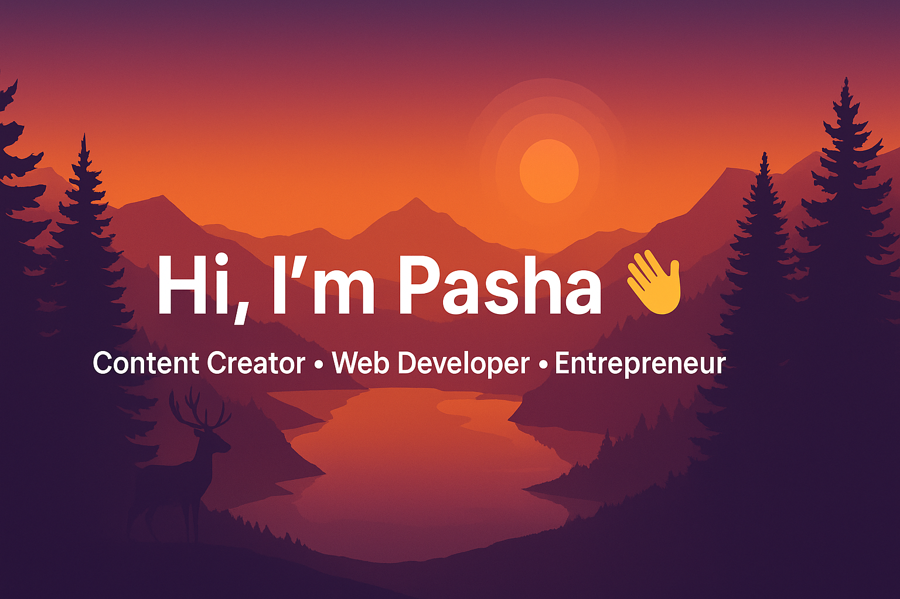

<!-- Banner -->

  

---

  
  
  

---

## 🚀 About Me
- Building web apps with QR attendance, dashboards, and automation.  
- Tech stack: React, Node.js, Express, PostgreSQL, Tailwind.  
- Love learning new tech and solving real problems.  
- Goal: produce digital products that scale.

---

## 💻 Technology Stack

  
  
  
  
  
  
  

---

## 📊 My GitHub Stats

### 🔥 Pasha’s GitHub Stats

  

---

### 🎨 Most Used Languages

  

---

